<!--
PORTFOLIO README — Arjun Krishna B
Design: monochrome · monospace · numbered sections · system-map aesthetic
Animations: each chart is a standalone SVG file referenced via  — GitHub's
Camo image proxy doesn't strip SMIL animations on .svg files served as images.
-->

<style>
@keyframes caret-blink { 50% { opacity: 0; } }
.caret { display: inline-block; width: 2px; height: 0.85em; background: #000; vertical-align: text-bottom; margin-left: 4px; animation: caret-blink 1s steps(2) infinite; }
</style>

<div align="center">

<table width="100%"><tr>
<td align="left"><sub>PORTFOLIO — INDEX N° 001</sub></td>
<td align="right"><sub>CHERTHALA, IN — 9.68° N · 76.34° E</sub></td>
</tr></table>

---

<h1>Arjun Krishna B<span class="caret"></span></h1>
<sub><b>Cybersecurity & Full-Stack Developer — Cherthala, India.</b></sub>

<sub>focus ▸ network security · full-stack systems · threat detection · AI-integrated products</sub>
<sub>open to internships · entry-level · collaboration</sub>

---

<sub>PYTHON & JAVASCRIPT &nbsp;·&nbsp; FULL-STACK SYSTEMS &nbsp;·&nbsp; NETWORK SECURITY &nbsp;&nbsp;&nbsp; VIT — 2023 / 2026</sub>

<br/>

<sub>
<a href="https://arjunportfolio.super.site">PORTFOLIO</a> &nbsp;
<a href="https://github.com/arjunkrishn">GITHUB</a> &nbsp;
<a href="https://linkedin.com/in/arjunn100">LINKEDIN</a> &nbsp;
<a href="mailto:arjunkb45@gmail.com">EMAIL</a>
</sub>

</div>

---

<table width="100%"><tr>
<td align="left">

# 01 &nbsp; <sub><b>WHOAMI</b></sub>

</td>
<td align="right">

`~/01-whoami`

</td>
</tr></table>

```
$ whoami
```

graduating **BCA specialized in AIML** at Vellore Institute of Technology, Cherthala.  
building across the **full stack** — Python · JavaScript · SQL · Linux · CLI tooling.  
drawn to projects where **security meets data** — clean architecture and threat response in equal measure.  

---

| | |
|---|---|
| **FOCUS**  | network security · full-stack systems · threat detection · AI-integrated architectures |
| **STATUS** | open to internships · entry-level · collaboration |
| **CLUBS**  | VIT — iSpace Club (Web & App Development) |

---

<table width="100%"><tr>
<td align="left">

# 02 &nbsp; <sub><b>SYSTEM MAP</b></sub>

</td>
<td align="right">

`~/02-system-map`

</td>
</tr></table>

<table width="100%"><tr>
<td align="left"><sub>SYSTEM MAP — EVERYTHING FROM ONE PIPELINE</sub></td>
<td align="right"><sub>FIG. 01</sub></td>
</tr></table>

<br/>

<div align="center">

</div>

---

<table width="100%"><tr>
<td align="left">

# 03 &nbsp; <sub><b>PROJECTS</b></sub>

</td>
<td align="right">

`~/03-projects`

</td>
</tr></table>

<br/>

## 01 / JOB-SHIELD — Fake Job Posting Detection
Intelligent fraud detection system classifying job postings as **genuine or fraudulent** using ML and NLP. Implements text preprocessing, TF-IDF & CountVectorizer feature extraction, and trains classification models. Evaluated via accuracy, precision, recall, F1-score.
<sub>PYTHON · SCIKIT-LEARN · PANDAS · NUMPY · NLTK · TF-IDF · NLP · MATPLOTLIB</sub>

---

## 02 / VULNSNIP — Vulnerability Scanner
Python-based vulnerability scanner identifying **security weaknesses and exposed services** on target systems. Implements automated host discovery, port scanning, service enumeration, and misconfiguration checks. Generates scan reports for risk identification.
<sub>PYTHON · NMAP · PYTHON-NMAP · SOCKET · TCP/IP · LINUX · THREADING</sub>

---

## 03 / NET-WATCH — Network Traffic Analyzer
Real-time Python-based network traffic analyzer monitoring communications. Implements **packet inspection and protocol analysis** to identify TCP, UDP, ICMP, DNS, and HTTP patterns. Generates traffic statistics and reports for anomaly detection.
<sub>PYTHON · SCAPY · PANDAS · MATPLOTLIB · SOCKET · TCP/IP · WIRESHARK</sub>

---

## 04 / AI-THREAT — AI Threat Detection System
Python-based system automating identification and classification of **cybersecurity threats** from network traffic. Uses data preprocessing, feature extraction, anomaly detection, and ML algorithms. Generates real-time alerts, risk assessments, and analytical reports.
<sub>PYTHON · SCIKIT-LEARN · PANDAS · NUMPY · STREAMLIT · ANOMALY DETECTION</sub>

---

## 05 / FORTIGATE-LAB — Firewall & Network Hardening
Internship project at Secure Solutions — installed, configured, and managed **FortiGate firewalls** to secure enterprise network infrastructure. Configured firewall policies, NAT, VLANs, and IPsec VPNs. Implemented IPS, Web Filtering, AV, Application Control.
<sub>FORTIGATE · FIREWALL · NAT · VLAN · IPSEC VPN · IPS · WIRESHARK</sub>

---

## 06 / UI-SHELF — Responsive Web Interfaces
Internship project at Techgentsia — assisted in developing and implementing **responsive web user interfaces**. Collaborated with development teams to support front-end design and testing activities.
<sub>HTML · CSS · JAVASCRIPT · RESPONSIVE DESIGN · UI/UX</sub>

---

<table width="100%"><tr>
<td align="left">

# 04 &nbsp; <sub><b>TELEMETRY</b></sub>

</td>
<td align="right">

`~/04-telemetry`

</td>
</tr></table>

<table width="100%"><tr>
<td align="left"><sub>TELEMETRY — WHAT THE HANDS ARE DOING</sub></td>
<td align="right"><sub>FIG. 02</sub></td>
</tr></table>

<br/>

<div align="center">

</div>

<br/>

<div align="center">

</div>

<br/>

<table width="100%">
<tr>
<td align="center" valign="top" width="25%">

# **18**
<sub>REPOSITORIES</sub>

</td>
<td align="center" valign="top" width="25%">

# **6**
<sub>PROJECTS DOCUMENTED</sub>

</td>
<td align="center" valign="top" width="25%">

# **4**
<sub>PLATFORMS — SEC / WEB / CLI / DATA</sub>

</td>
<td align="center" valign="top" width="25%">

# **∞**
<sub>TERMINAL TABS OPEN</sub>

</td>
</tr>
</table>

<br/>

<table width="100%">
<tr>
<td width="50%" valign="top">



</td>
<td width="50%" valign="top">



</td>
</tr>
</table>

<br/>

<div align="center">

</div>

---

<table width="100%"><tr>
<td align="left">

# 05 &nbsp; <sub><b>THE ROUTE</b></sub>

</td>
<td align="right">

`~/05-journey`

</td>
</tr></table>

<table width="100%"><tr>
<td align="left"><sub>THE ROUTE SO FAR</sub></td>
<td align="right"><sub>FIG. 03</sub></td>
</tr></table>

<br/>

<div align="center">

</div>

---

| year | role |
|------|------|
| **2026** | **Secure Solutions · Network Security Intern · Kochi** — installed, configured, and managed FortiGate firewalls · configured firewall policies, NAT, VLANs, IPsec VPNs · implemented IPS, Web Filtering, AV, Application Control · monitored firewall logs and security events |
| **2026** | **VIT · Summer Research Intern (SRIP 2026)** — research pipeline combining confidence scoring, named-entity routing, evidence retrieval and contradiction checks · applied to threat-detection workflows |
| **2025** | **Techgentsia Software Technologies · Web UI Development Intern · Infopark Pallipuram** — assisted in developing responsive web UIs · collaborated with dev teams on front-end design and testing |
| **2023 – 2026** | **Vellore Institute of Technology · BCA — Specialized in AIML** · CGPA 7.67/10 · coursework: AI, ML, Computer Networks, DBMS, Programming, Software Development |

---

<table width="100%"><tr>
<td align="left">

# 06 &nbsp; <sub><b>STACK</b></sub>

</td>
<td align="right">

`~/06-stack`

</td>
</tr></table>

<br/>

| | |
|---|---|
| **LANGUAGES** | Python · JavaScript · SQL · Bash · C/C++ · HTML/CSS |
| **SECURITY**  | FortiGate · Nmap · Wireshark · Linux · TCP/IP · VLAN · NAT · VPN · IPSec |
| **DATA / ML** | Pandas · NumPy · Scikit-learn · NLTK · TF-IDF · Matplotlib · Seaborn · Streamlit |
| **WEB**       | HTML · CSS · JavaScript · Responsive UI · React (basics) |
| **NETWORK**   | Scapy · Socket · Packet Analysis · Protocol Inspection · Nmap |
| **TERMINAL**  | TUI / CLI · Linux shell · keyboard-driven workflows |
| **TOOLING**   | Git · GitHub · Docker (basics) · Jupyter · VS Code · Figma · Postman |

---

<div align="center">

<sub>end of transmission — arjunkb45@gmail.com</sub>

<sub>↑ built from a one-person build pipeline · `&lt;3` open source</sub>

</div>
