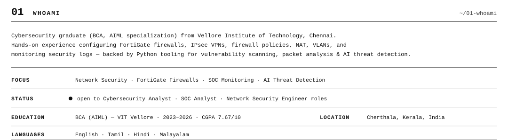
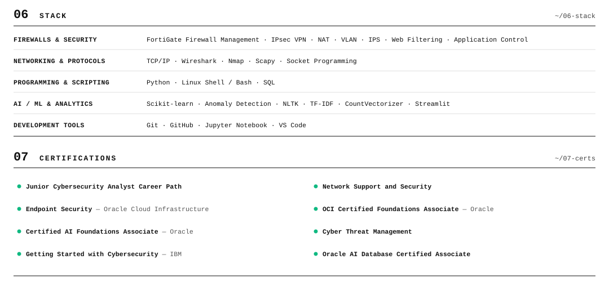

[`PORTFOLIO`](https://arjunportfolio.super.site) &nbsp;·&nbsp; [`RESUME`](mailto:arjunkb45@gmail.com) &nbsp;·&nbsp; [`LINKEDIN`](https://linkedin.com/in/arjunn100) &nbsp;·&nbsp; [`GITHUB`](https://github.com/arjunkrishn) &nbsp;·&nbsp; [`EMAIL`](mailto:arjunkb45@gmail.com)

 

 

 

 

 

 

 

`EN` `TA` `HI` `ML` &nbsp;&nbsp;·&nbsp;&nbsp; [arjunkb45@gmail.com](mailto:arjunkb45@gmail.com) &nbsp;&nbsp;·&nbsp;&nbsp; Cherthala, Kerala, India

