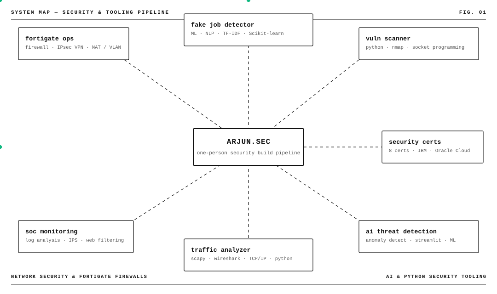
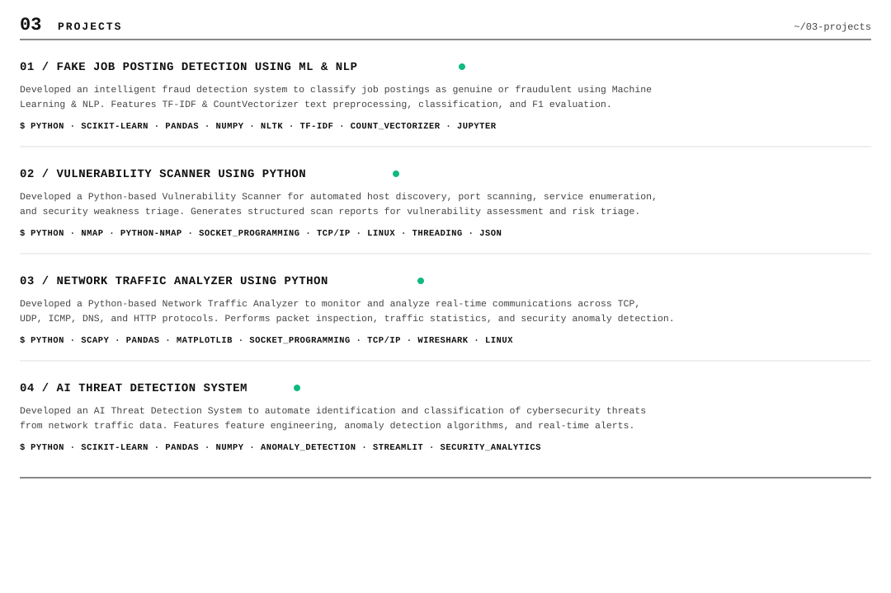
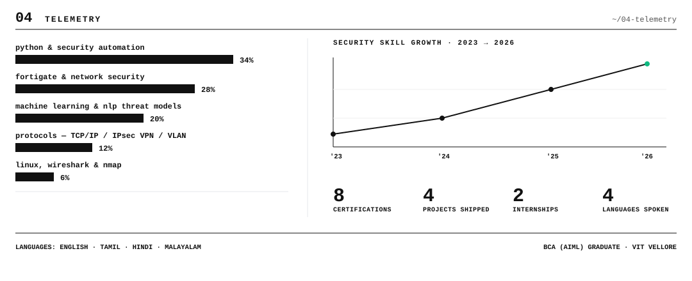

[`PORTFOLIO`](https://arjunportfolio.super.site) &nbsp;·&nbsp; [`RESUME`](mailto:arjunkb45@gmail.com) &nbsp;·&nbsp; [`LINKEDIN`](https://linkedin.com/in/arjunn100) &nbsp;·&nbsp; [`GITHUB`](https://github.com/arjunkrishn) &nbsp;·&nbsp; [`EMAIL`](mailto:arjunkb45@gmail.com)

 

### `01` WHOAMI &nbsp;~/01-whoami
---

Cybersecurity graduate (BCA, AIML specialization) from Vellore Institute of Technology.
Hands-on experience configuring FortiGate firewalls, IPsec VPNs, firewall policies, NAT, VLANs, and monitoring security logs — backed by Python tooling for vulnerability scanning, traffic analysis, and machine learning threat detection.

| | |
|---|---|
| **FOCUS** | Network Security · FortiGate Firewalls · SOC Monitoring · AI Threat Detection |
| **STATUS** | Open to Cybersecurity Analyst · SOC Analyst · Network Security Engineer roles |
| **EDUCATION** | BCA (AIML Specialization) — VIT Vellore · 2023–2026 · CGPA 7.67/10 |
| **LOCATION** | Cherthala, Kerala, India |
| **LANGUAGES** | English · Tamil · Hindi · Malayalam |

 

 

### `03` PROJECTS &nbsp;~/03-projects
---

 

**01 / FAKE JOB POSTING DETECTION USING ML & NLP**
Developed an intelligent fraud detection system to classify job postings as genuine or fraudulent using Machine Learning and NLP. Implemented text preprocessing, feature extraction using TF-IDF and CountVectorizer, and trained classification models to accurately detect recruitment scams. Evaluated performance using accuracy, precision, recall, and F1-score.
`PYTHON` · `SCIKIT-LEARN` · `PANDAS` · `NUMPY` · `NLTK` · `TF-IDF` · `COUNT_VECTORIZER` · `JUPYTER`

**02 / VULNERABILITY SCANNER USING PYTHON**
Built a Python-based scanner to identify security weaknesses and exposed services on target systems. Automated host discovery, port scanning, service enumeration, and misconfiguration checks against common insecure services, producing detailed reports for risk assessment.
`PYTHON` · `NMAP` · `PYTHON-NMAP` · `SOCKET_PROGRAMMING` · `TCP/IP` · `THREADING` · `LINUX` · `JSON`

**03 / NETWORK TRAFFIC ANALYZER USING PYTHON**
Created a real-time network traffic monitoring tool performing packet inspection and protocol analysis across TCP, UDP, ICMP, DNS, and HTTP traffic. Generates traffic statistics and reports for security anomaly detection.
`PYTHON` · `SCAPY` · `PANDAS` · `MATPLOTLIB` · `SOCKETS` · `TCP/IP` · `WIRESHARK` · `LINUX`

**04 / AI THREAT DETECTION SYSTEM**
End-to-end Python pipeline automating threat identification from network traffic and security log data. Uses data preprocessing, feature engineering, and anomaly detection algorithms to output real-time alerts and risk assessments.
`PYTHON` · `SCIKIT-LEARN` · `PANDAS` · `ANOMALY_DETECTION` · `STREAMLIT` · `SECURITY_ANALYTICS`

 

 

### `05` THE ROUTE &nbsp;~/05-journey
---

**2026 · Secure Solutions — Network Security Intern · Kochi**
Installed, configured, and managed FortiGate firewalls to secure enterprise network infrastructure. Configured firewall policies, NAT, VLANs, and IPsec VPNs. Implemented IPS, Web Filtering, Antivirus, and Application Control features while monitoring logs to apply network security best practices.

**2025 · Techgentsia Software Technologies — Web UI Development Intern · Infopark Pallipuram**
Assisted in developing and implementing responsive web user interfaces. Supported front-end design and testing activities in collaboration with development teams.

**2023–2026 · Vellore Institute of Technology — BCA (AIML Specialization)**
Completed BCA with CGPA 7.67/10. Coursework across Artificial Intelligence, Machine Learning, Computer Networks, DBMS, Programming, and Software Development.

 

### `06` STACK &nbsp;~/06-stack
---

| Category | Core Competencies |
|---|---|
| **FIREWALLS & SECURITY** | FortiGate Firewall Management · IPsec VPN · NAT · VLAN · IPS · Web Filtering · Antivirus · Application Control |
| **NETWORKING & PROTOCOLS** | TCP/IP · Wireshark · Nmap · Scapy · Socket Programming |
| **PROGRAMMING & SCRIPTING** | Python · Linux Shell / Bash · SQL |
| **AI / ML & ANALYTICS** | Scikit-learn · Anomaly Detection · NLTK · TF-IDF · CountVectorizer · Pandas · NumPy · Streamlit |
| **DEVELOPMENT TOOLS** | Git · GitHub · Jupyter Notebook · VS Code |

 

### `07` CERTIFICATIONS &nbsp;~/07-certs
---

- **Junior Cybersecurity Analyst Career Path**
- **Endpoint Security** — Oracle Cloud Infrastructure
- **Certified AI Foundations Associate** — Oracle
- **Getting Started with Cybersecurity** — IBM
- **Network Support and Security**
- **Oracle Cloud Infrastructure Certified Foundations Associate**
- **Cyber Threat Management**
- **Oracle AI Database Certified Foundations Associate**

 

`EN` `TA` `HI` `ML` &nbsp;&nbsp;·&nbsp;&nbsp; [arjunkb45@gmail.com](mailto:arjunkb45@gmail.com) &nbsp;&nbsp;·&nbsp;&nbsp; Cherthala, Kerala, India

